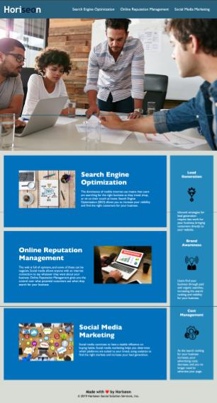

# <HTML, CSS, and Git: Code Refactor>

## A codebase that follows accessibility standards
## so that your own site is optimized for search engines

Provide a short description explaining the what, why, and how of your project. Use the following questions as a guide:

This project helped resolve a link issue as well as improve appearance and functionality. I learned more about CSS coding and how it works in relationship to HTML. I was also able to develop a short guide on steps necessary to push this project to GitHub.

## Installation

    Step 1: Create a GitHub repo and clone it to your machine
    Step 2: Copy the challenge folder to your cloned GitHub folder
    Step 3: Make necessary edits to the HTML and CSS files
    Step 4: Be sure to save your changes regularly
    Step 5: Push changes to your Githib repo regularly

## Credits

Valuable tools include the following websites:
    --https://www.atlassian.com/git/tutorials/syncing/git-fetch#:~:text=In%20review%2C%20git%20fetch%20is,the%20state%20of%20a%20remote.
    
    --https://developer.mozilla.org/en-US/docs/Learn
    
## Mock-Up

The following image shows the web application's appearance and functionality:

## License

Copyright (c) 2023 Wayne

Permission is hereby granted, free of charge, to any person obtaining a copy
of this software and associated documentation files (the "Software"), to deal
in the Software without restriction, including without limitation the rights
to use, copy, modify, merge, publish, distribute, sublicense, and/or sell
copies of the Software, and to permit persons to whom the Software is
furnished to do so, subject to the following conditions:

The above copyright notice and this permission notice shall be included in all
copies or substantial portions of the Software.

THE SOFTWARE IS PROVIDED "AS IS", WITHOUT WARRANTY OF ANY KIND, EXPRESS OR
IMPLIED, INCLUDING BUT NOT LIMITED TO THE WARRANTIES OF MERCHANTABILITY,
FITNESS FOR A PARTICULAR PURPOSE AND NONINFRINGEMENT. IN NO EVENT SHALL THE
AUTHORS OR COPYRIGHT HOLDERS BE LIABLE FOR ANY CLAIM, DAMAGES OR OTHER
LIABILITY, WHETHER IN AN ACTION OF CONTRACT, TORT OR OTHERWISE, ARISING FROM,
OUT OF OR IN CONNECTION WITH THE SOFTWARE OR THE USE OR OTHER DEALINGS IN THE
SOFTWARE. [https://choosealicense.com/](https://choosealicense.com/).

---
